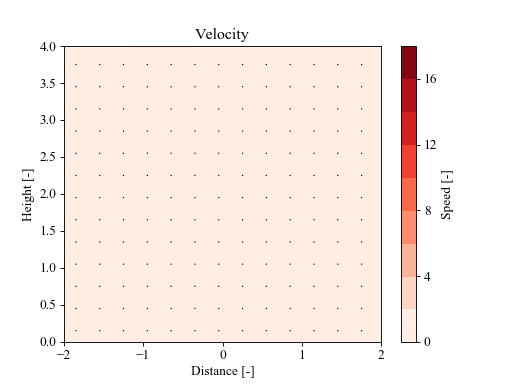

# rotunno83
Python and Fortran scripts for solving the differential equations in Rotunno's 1983 paper "On the Linear Theory of the Land and Sea Breeze" (<`https://doi.org/10.1175/1520-0469(1983)040&lt;1999:OTLTOT>2.0.CO;2`>).

