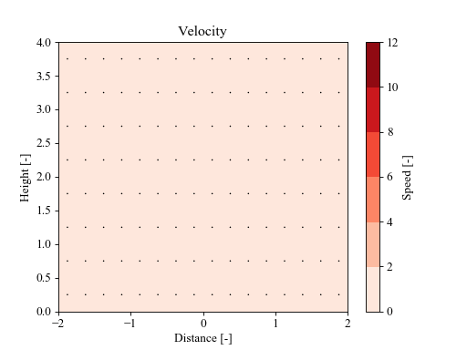
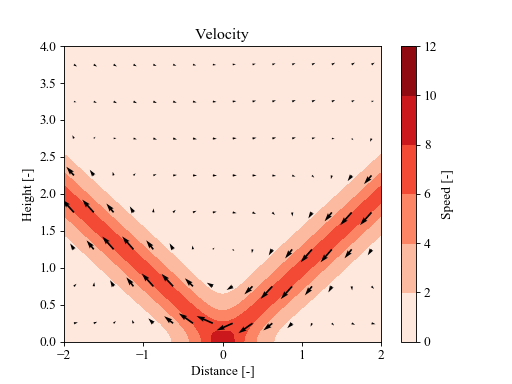

# rotunno83
Python and Fortran scripts for solving the differential equations in Rotunno's 1983 paper ["On the Linear Theory of the Land and Sea Breeze"](https://doi.org/10.1175/1520-0469(1983)040&lt;1999:OTLTOT>2.0.CO;2).

The NetCDF Fortran libraries are required for this code to compile - note that when compiling a script that links to Fortran .mod files, the same version of gfortran must be used as was used to compile the .mod files! This can make running remotely difficult. 
