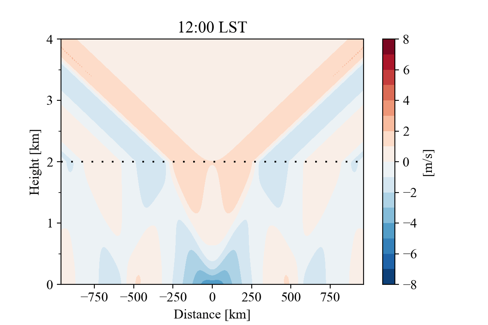
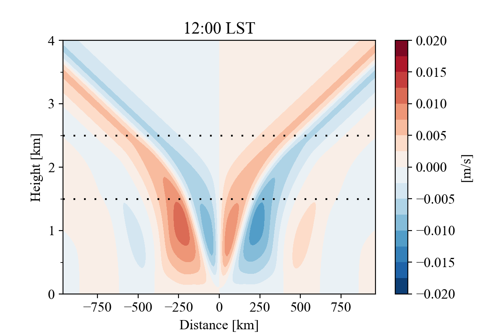

# rotunno83
Scripts for a variety of linear theory solutions related to the theory of Rotunno (1983). In particular, scripts for producing the solutions of Short et al. (2023), which extend the theory of Rotunno (1983) to varying stability.

Below are some animated versions of the figures presented in the paper of Short et. al (2023). The animations depict how forced gravity waves reflect and refract at stability changes. In all figures the Brunt-Vaisala frequency in the upper subdomain is triple that in the lower subdomain. In the "piecewise-constant" solution, the stability change occurs as a discontinuity. In the "transition-layer" solution, the stability changes linearly (and continuously) over the middle layer, with substantially less wave reflection as a result. Buoyancy fields can be found in the folder `buoyancy_figs`. See Short et al. (2023) for further details.

|  |
|:--:|
| *Linear vertical displacement, piecewise-constant case.* |

|  |
|:--:|
| *Linear vertical displacement, transition-layer case.* |

|  |
|:--:|
| *Velocity, piecewise-constant case.* |

|  |
|:--:|
| *Velocity, transition-layer case.* |

|  |
|:--:|
| *Horizontal velocity, piecewise-constant case.* |

|  |
|:--:|
| *Horizontal velocity, transition-layer case.* |

|  |
|:--:|
| *Vertical velocity, piecewise-constant case.* |

|  |
|:--:|
| *Vertical velocity, transition-layer case.* |
